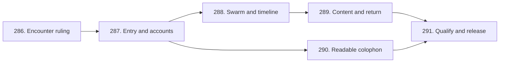

# Portfolio experience: approval and publication receipt

The sole shared implementation specification is
[portfolio#285: Portfolio experience: continuity, discovery, and depth](https://github.com/mechanistic-org/portfolio/issues/285).
It governs both homepage and colophon work. This file records approval,
publication verification and the bounded handoff. Requirement changes belong in
#285 and its affected children through their stated review gates.

## Approval identity

Erik approved the concrete v2 specification and six-ticket graph on
2026-09-11 UTC / 2026-09-10 America/Los_Angeles:

> Approve v2 specification and graph

The immutable [reviewed v2 packet](https://github.com/mechanistic-org/portfolio/blob/1fab482613c377d685872d73b19970d980bb0bff/docs/plans/portfolio-experience-review.md)
remains available at commit
`1fab482613c377d685872d73b19970d980bb0bff`.
Its SHA256 is
`8f6d391e1eec5f77075e45670ff8a1d30e9282072e2607d5d306cb8e382aa7bf`.
The file and committed blob matched that hash before publication.

The [supporting findings](../research/portfolio-experience/2026-09-11-findings.md)
preserve dated observations, sources and research limitations. They support #285;
they are not an implementation specification. Exact private source-task and
attachment provenance remains in local transaction custody.

## Accepted decisions and remaining review

Approval adopts PE-01 through PE-17, AC-01 through AC-09, the six-ticket graph and
the 22-item colophon disposition register in #285. The contract preserves Erik's
"mortar" language, physical/software continuity, a swarm-led encounter, distinct
preview/reading/pin states, readable qualifications, real URLs and static output.
The representative path is scan -> acquire -> hold -> read -> follow -> return -> resume.
Accessibility and direct access belong inside every slice.

The exact acquisition method, hold/pin behavior and timeline treatment still need
the prototype ruling in #286. Exact introduction, colophon wording/layout and
attribution require their candidate reviews. The retained colophon opening is a
draft. A release requires a separately approved, identified production candidate
in #291. Approval of this plan does not establish usability or approve deployment.

The disposition register retains accepted history, approved changes, unresolved
choices and explicit defer/drop decisions. It does not turn every source-review
idea into promised implementation. #278's shared-claim correction and satire
retirement, focused constellation delivery and #220's historical reader-study
waiver remain completed history.

## Published and verified graph

All seven issues are Open, assigned to eriknorris, in milestone **Portfolio W8
Delivery**, with P2 priority and portfolio node. The parent is Epic / Aesthetic /
Backlog. The administrative assignee is not an agent lane reservation.

| Order | Child | Native blockers | Size / Impact | Main Board |
|---|---|---|---|---|
| 1 | [#286 - Prove one discovery encounter and record the interaction ruling](https://github.com/mechanistic-org/portfolio/issues/286) | None | Task / R&D | Ready |
| 2 | [#287 - Make homepage entry and contextual accounts coherent](https://github.com/mechanistic-org/portfolio/issues/287) | #286 | Enhancement / Aesthetic | Backlog |
| 3 | [#288 - Couple the swarm and career timeline for stable reading](https://github.com/mechanistic-org/portfolio/issues/288) | #287 | Enhancement / Aesthetic | Backlog |
| 4 | [#289 - Carry exploration through content and restore its origin](https://github.com/mechanistic-org/portfolio/issues/289) | #288 | Enhancement / Aesthetic | Backlog |
| 5 | [#290 - Make the colophon explain the record with readable qualifications](https://github.com/mechanistic-org/portfolio/issues/290) | #287 | Enhancement / Aesthetic | Backlog |
| 6 | [#291 - Qualify and release the accepted portfolio encounter](https://github.com/mechanistic-org/portfolio/issues/291) | #289, #290 | Task / Aesthetic | Backlog |



The graph preserves the approved merge/split decisions. Entry/content can improve
the current interface; swarm, chronology and held account require one shared
state owner; cross-page return has its own failure cases; colophon is independently
reviewable; qualification joins the accepted slices. Logical branching does not
authorize simultaneous portfolio writers. Order breaks ties.

Cold-read verification on **2026-09-11 at 02:26-02:27 UTC** established:

- Each published body matched its deterministic expansion from the immutable
  approved packet. Changes were limited to adoption status, actual issue URLs,
  native-graph references and required issue-template/closeout metadata.
- #285 has exactly the six approved native children in order. Each child reports
  #285 as its native parent. Every incoming and outgoing dependency matches the
  six edges above, with no extra edges or cycle.
- Bodies, open state, unchecked DoD, labels, assignee, milestone and all five Main
  Board fields matched the approved contract. #283 remains the separate planning
  task; completing it does not close #285 or begin #286.
- #286 is the only child with no open native blockers. It is the starting graph
  frontier, subject to a fresh check of actual lane holders and its scoped gates.
- #229 remained Open / In progress and #250 Open / In review at the final campaign
  read. Their state and integration paths were not changed by this task.

## Planning closeout boundary

The release outcome for [#283](https://github.com/mechanistic-org/portfolio/issues/283)
is the approved specification, verified graph and supporting documentation.
Its final issue receipt records landed commit identity and normal close checks.
Only this receipt and the supporting findings are tracked planning outputs.
No production implementation, prototype, deployment, claim/canon/evidence edit,
asset work, automation or outgoing task prompt occurred in #283.

Research established bounded desktop/HTTP/source observations and the documented
reference behaviors described in the findings. It did not exercise the proposed
rapid strum, mobile timeline or unpinned restoration, or conduct an unfamiliar-reader
study. Those limitations are carried into the children's evidence requirements.

## Sole-ticket fresh-session handoff

The live graph frontier at publication is #286 only. Refresh it at pickup because
GitHub state and lane ownership can change. A Ready field and empty native blocker
records do not override the actual lane holder or an unresolved ruling.

```text
Execute only mechanistic-org/portfolio#286, "Prove one discovery encounter and record the interaction ruling":
https://github.com/mechanistic-org/portfolio/issues/286

Treat #286 as the sole work input. Read the repository front door, #286 with comments, its governing specification #285 and the requirement/source references those issues name. Cold-read native blockers, current main and actual lane holders before mutation. The specification and graph are approved; exact prototype feel and interaction choices still need Erik's ruling.

Use a separate disposable documentation/prototype worktree from current origin/main. Complete the current mutation checkpoint with #286 as the focal ticket. Declare exact Assets and exclusions. The only durable output is docs/research/portfolio-experience/encounter-ruling.md; the disposable prototype belongs under ignored var/prototypes/experience/. Do not claim or edit the #229/#250 campaign integration lanes. Resolve an actual lane conflict before writing.

Build and exercise the one representative encounter and alternate-input/return cases required by #286. Compare its two material acquisition/timeline alternatives with constant current public content; record actual parameters, exact prototype identity/hash, participants, observations and limitations. Do not invent timing targets or imply an unperformed unfamiliar-reader study. Obtain Erik's exact go/refine/no-go ruling and preserve the accepted implementation choices or truthful unresolved handoff.

No production UI/routes/dependencies, generated project pages, canon/evidence, claim facts, assets, campaign work, deployment, automations or prompts to other tasks. Add no speculative follow-on scope. If a required ruling remains unresolved, keep the ticket truthfully open.

On satisfying #286's DoD, remove disposable outputs, validate and land the accepted ruling on origin/main with exact-path staging, publish the normal close receipt, close #286 and mark it Done on the Main Board, reconcile #285 and the live next frontier, release the lane and stop. Do not start #287 or any sibling.
```
