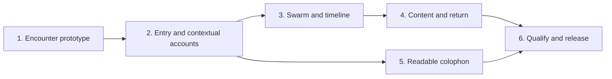

# Portfolio experience: continuity, discovery, and depth

Review packet v2, prepared 2026-09-11 UTC / 2026-09-10 America/Los_Angeles.
Focal planning task: [portfolio#283](https://github.com/mechanistic-org/portfolio/issues/283).
**Status: proposed specification and proposed graph, awaiting Erik's approval.**

This is the concrete review copy. On approval, the specification below will become
one GitHub issue, following [the repository convention](../agents/issue-tracker.md).
That issue will govern both homepage and colophon work. This file will then become
an approval/graph receipt with a pointer to that authority, rather than a second
editable specification. Supporting [research and current-state findings](../research/portfolio-experience/2026-09-11-findings.md)
have a different purpose: they preserve observations, sources and limitations.

Approval requested: the specification's proposed requirements and the six-ticket
breakdown, including dependencies and scope. This does not approve prototype feel,
new factual claims, exact public copy or a production release in advance.

## Proposed shared specification

### Purpose and authority

The portfolio should make Erik's continuous engineering practice understandable
across physical products, recovered evidence, software systems, pragmatic
AI-assisted engineering operations and the experience of discovering that work.
The primary decision audience remains the senior engineering, product and
technical-business leaders defined in [CONTEXT.md](../../CONTEXT.md).
Approachable discovery should also work for people unfamiliar with that vocabulary.

**Accepted intent:** ResVizSwarm is central; the homepage guides discovery through
its responses. A separately labeled Tour should not be the main explanation.
Physical products and software systems both deserve substantive treatment. AI has
expanded execution capacity and examination of accumulated work through software
construction, evidence recovery, comparison, documentation and sustained coordination.
Explain that through actual decisions, demonstrated work and visible limitations.

Erik's source metaphor is preserved exactly: **"the mortar. the sense of cohesion
and solidity. but also courses and rows and depth."** This expresses a desired
quality; it does not require masonry imagery, a literal building or a sequence of
levels. His phrase **"appify"** means coherent behavior and continuity while
keeping essential destinations directly available.

**Accepted starting encounter:** scan -> acquire -> hold -> read -> follow ->
return -> resume. It is a representative path, not a prerequisite for reading a
project, method, qualification or software account.

**Provisional preference:** replace the visible project list with a career timeline
related to the project-page career context ribbon, with a snap/zoom response to
strumming. The exact geometry, acquisition trigger and motion remain unvalidated.

### Source and decision history

The planning task retains an ignored local provenance manifest with exact task,
turn and attachment references. Public summaries below preserve operator intent;
they do not publish raw private conversations or audit material.

| Date | Source | Authority and disposition |
|---|---|---|
| 2026-08-22 | "Inventory AI work" | Historical audit. Measurements, maturity and runtime statements belong to that snapshot. Later corrections reported in the September task must not be folded silently into the August record. No old inventory number becomes current homepage copy. |
| 2026-08-30/31 | [#164](https://github.com/mechanistic-org/portfolio/issues/164), [#211](https://github.com/mechanistic-org/portfolio/issues/211) | Focused constellation delivered; preserve incident approved edges, semantic relationship text, employer colors and zero lines at rest. Earlier blocked/coverage-gate descriptions are superseded. |
| 2026-09-05/06 | [#137](https://github.com/mechanistic-org/portfolio/issues/137), [#138](https://github.com/mechanistic-org/portfolio/issues/138) | Career context ribbon and C24 delivery chronology exist. They represent different kinds of time and are not interchangeable. |
| 2026-09-06 | [#220 close receipt](https://github.com/mechanistic-org/portfolio/issues/220#issuecomment-5560719084) | Tour narrative work closed with an explicit reader-requirement waiver. Mechanical acceptance is historical evidence; an independent reader study was not established. Do not reopen the completed ticket. |
| 2026-09-10 local | [#278 release receipt](https://github.com/mechanistic-org/portfolio/issues/278#issuecomment-5627180802) | Shared-claim corrections and satire-wall removal shipped. Preserve both; neither is a new workstream here. |
| 2026-09-10 local | "Audit eriknorris.com evidence" | Erik made ResVizSwarm central and rejected a foreground Tour as the main solution. He provisionally favored a timeline and supplied the microfiche recollection. Earlier assistant advice to foreground the Tour is superseded. |
| 2026-09-10 local | "Analyze and advise on colophon" | Read-only findings and proposals. Complete summaries, hierarchy changes, selected hardware examples, title changes and a production-process introduction were recommendations, not wholesale operator approval. |
| 2026-09-10 local | "Analyze AI work exploration" | Erik explicitly approved continuity of practice, pragmatic AI positioning, expanded execution/examination capacity and the encounter as a starting point. Machinarium, greater approachability and possible deeper easter eggs are references/directions, not an approved game implementation. |
| 2026-09-10 local | Commission captured under #283 | Authorizes this bounded analysis, specification, reviewed graph and planning closeout. Site implementation/deployment and campaign mutation are excluded. |

**Personal reference, accepted recollection:** Erik spent hours each week,
sometimes tens of hours, reading microfiche in libraries as a child. Earlier
homepage iterations used "fiche strips." He described the desired
**"fast-scan then quick-locked-frame effect"**. No psychological or autobiographical
theory is inferred. A public personal note remains an exact-copy review item.

### Terminology and experience principles

These are **proposed operational definitions**, not new canon classifications.

| Term | Concrete meaning |
|---|---|
| Cohesion | The same work keeps its identity, attribution, meaning and available next steps across surfaces. |
| Breadth | A reader can recognize the range of physical and software work and directly reach substantive examples without exploring every item. |
| Lateral connection | A clearly labeled route to another practice, temporal neighbor or approved project relationship. Its kind is visible. |
| Depth | More explanation of the constraint, contribution, decision, evidence and production of the account. It is optional detail, not a level to unlock. |
| Acquisition | Attention resolves to one identifiable subject whose reading frame can be reached without chasing a moving target. |
| Holding | The acquired frame remains readable while the pointer leaves the target, enters its details or makes incidental movements. Holding is not pinning. |
| Selection / pin | An explicit action creates a persistent named reference. Preview or elapsed time never silently pins a project. |
| Return continuity | Following content and returning restores a recognizable exploration place: subject, pin, lens, timeline window and meaningful focus/scroll position where available. |
| Temporary preview | Reversible identification of the project currently being scanned; no URL write and no replacement of a held reading frame merely because a target was crossed. |
| Reading frame | A stable title, complete consequential account and useful links for one acquired subject. Distinct from a transient label and from the optional pinned reference. |

Solidity comes from stable acquisition, qualified accounts and reliable navigation.
Courses and rows translate to readable chronology and explicit groupings; proximity
does not imply causation. Discoveries should answer a question raised by the work.
The page gives a visible first foothold before inviting exploration.

### Tensions and chosen tradeoffs

| Tension | Proposed decision and remaining test |
|---|---|
| Immediate response versus stable reading | Preview identifies immediately; acquisition commits a readable subject. Keep a held frame stable and label any different preview explicitly. T1 tests whether this distinction is apparent. |
| Discoverable depth versus obvious access | Offer contextual discoveries and ordinary links together. No compulsory sequence, hidden qualification or game skill is required. |
| Whole-career breadth versus small-screen density | Combine overview, local neighborhood and reachable semantic records. T1 selects geometry; no fixed project quota or invented chronology. |
| Persistent pin versus freedom to inspect another target | Preserve an explicitly labeled reference while allowing another acquired reading subject, with one visible Return to pinned action. Simplify if T1 exposes confusion. |
| State restoration versus native navigation | Preserve semantic origin with bounded session state, while URL intent and ordinary browser behavior take precedence. No custom router or backend. |
| Concise copy versus complete qualifications | Shorten only through approved complete assertions; allow space to grow when the limit changes meaning. Never clip the qualification to meet a visual quota. |
| New coherence versus campaign throughput | Consume existing accepted public accounts and shared components. Keep planning disjoint and implementation serialized; new source curation is not a dependency for this encounter. |

### Responsibilities of each surface

| Surface | Owns | Boundary |
|---|---|---|
| Homepage introduction | One coherent description of the breadth of practice; direct work, software, method, resume and contact routes. | No competing hero identities, new career-title authority, activity-score dashboard or general AI manifesto. |
| ResVizSwarm | Scanning, immediate target identification, lens grouping and approved focused constellations. | Stable employer identity; no inference of relationship meaning from proximity, tags or motion. |
| Career timeline | Career overview, recorded spans, explicit undated access and a readable local neighborhood of the acquired project. | Not a project event chronology and not a new source of dates. It coordinates with the swarm, rather than becoming a second selection store. |
| Contextual reading frame | One complete account of a consequential decision, with contribution, qualifications and a relevant next link. | No fragmented metric, clipped limitation or unreviewed summary generator. Sparse records remain honest and usable. |
| Project page | Full accepted engineering account, its chronology/evidence and substantive vertical reading. | Generated MDX remains a read-only projection. Shared shell navigation can improve without rewriting claims or page content. |
| How I Work | Recurring practices demonstrated by concrete instances; full method and the existing Pulse entry remain directly reachable. | A shared practice does not establish historical transfer between projects. |
| Colophon / EN-OS | How the record is built, software decisions and the division of machine assistance, checks and Erik's acceptance. | Explain specific mechanisms and failures, retain qualifications; do not turn checks into proof of truth. |
| Build Log | Dated consequential changes, reversals and lessons. | Preserve event/publication-date distinctions; no entry quota, live activity feed or invented completion claim. |

### Requirements

Unless labeled otherwise, requirements below are **proposed for approval**. They
translate accepted intent into observable behavior. Existing repository invariants
remain binding independently of this proposal.

**PE-01 - Entry and direct access.** Give the homepage one professional introduction
covering physical products, software systems and pragmatic AI-assisted operations.
Provide a conspicuous native link to an existing substantive software account
(initially EN-OS), as well as project, method, resume and contact access. Do not invent
a dated software project in the hardware roster merely to equalize representation.
Keep useful introductory context short enough to coexist with the work, without
setting a word quota or requiring the visitor to learn the interface first.

**PE-02 - State ownership.** Extend the existing HXO state boundary rather than
creating independent swarm, timeline and reading-panel stores. Track conceptual
preview P, acquired reading subject R and explicit pin S separately. These symbols
describe required behavior, not mandated atom names. At rest R is the reading subject;
if no R exists a valid S can supply it. A preview never overwrites S. Pinning a target
sets S and R to that target. Clearing a pin does not silently discard an unrelated R.

**PE-03 - Rapid scan and target stability.** Crossing targets updates P and its
identity cue immediately; pending movement retargets the latest subject instead of
queuing old destinations. The held R remains labeled "Reading [title]" while a
different P is labeled as a preview. Once acquisition occurs, swarm emphasis,
timeline neighborhood, frame title and account agree on R. Target hit areas do not
move, shrink or become covered in response to acquisition itself. Trial continuous
motion freezing/settling during active scanning; preserve the existing persistent
Pause control. Do not move the swarm to produce the timeline's snap/zoom effect.

**PE-04 - Acquire, hold and resume.** An explicit read/selection action acquires a
subject without timing-dependent input. Settling may also acquire without a click
if the prototype demonstrates a reliable rule. While the pointer or keyboard focus
is inside the frame, its text and links remain stable. Leaving the source target or
making incidental movement never dismisses the acquired frame. A deliberate new
acquisition replaces R; a clearly available Resume scanning action releases the
frame for another acquisition without resetting lens, chronology or pin. No timer
closes a reading frame. Hover/focus supplements are dismissible, hoverable and
persistent under WCAG 1.4.13; dismissal must not immediately reopen the same preview.

**PE-05 - Pin provenance.** Offer explicit, named Pin, Unpin and Return to pinned
controls when relevant. If R differs from S, distinguish "Reading B" and "Pinned A"
without showing two competing full accounts. Return to pinned acquires A again.
Incidental preview does not clear either R or S. Escape clears transient preview
first; subsequent clearing/unpin behavior is visible and consistent with the
prototype ruling. Keyboard text entry and native controls keep their usual keys.
Do not let an Escape intended for a dialog also unpin the project.

**PE-06 - Timeline and truthful chronology.** Prefer one whole-career overview plus
an acquired-project neighborhood over enlarging the existing seven-item ribbon
unchanged. Chronological order uses recorded dates, independently of deep-dive/lite
tier. Same-date ties and collision lanes are deterministic. Dense periods expose
all members through a labeled expansion or readable equivalent; nodes cannot become
unreachable because labels overlap. Missing start dates appear in an explicit
"Date not established" group, not at build time, year zero or a fabricated point.
Missing/reversed ends do not imply a continuing project: render a dated point with
honest precision. Keep career span from its existing career authority. Do not infer
project dates from that span. Employer/category lenses retain their distinct meaning.
The timeline may remain chronological under another lens, with the active grouping
clearly named. Its exact geometry is the first prototype's decision.

**PE-07 - Effects have consistent meanings.** Fill means employer identity via the
existing color registry; focus/outline/labels distinguish preview, reading and pin.
Employer identity never changes to encode quality, maturity or a relationship.
Chronological position means recorded time; selected-lens grouping means that
grouping only. Relationship lines mean only approved explicit edges and have no
independent animation. Shape, text and focus styling carry state without color.
Nonessential sound is not introduced; audio already present remains opt-in.

**PE-08 - Three kinds of connection.** Label temporal neighbors, shared practice and
verified project relationships separately. Practice links are editorial associations
to existing method examples, not new canon edges. Only the existing deterministic
public relationship projection may produce lines and relationship claims. Keep zero
lines with no focused subject and only its incident approved edges when focused.
Show an honest absence message where no direct relationship is recorded; absence
does not prove isolation. Preserve native related-project anchors and approved claim
text. Do not restore the retired coverage quota or invent edges to populate a demo.

**PE-09 - Complete, accountable context.** Each selected example exposes its relevant
constraint, Erik's contribution, decision or intervention, and outcome/limit to the
extent the current public record supports them. Reuse the existing complete shared
assertions and governed public projection. New homepage occurrences need explicit
consumer registration and built-output checks, not copied sentences or hand-edited
generated JSON. Adding a display location may reuse an accepted variant verbatim;
changing assertion/variant meaning requires the existing exact canon review. No
claim correction, source mining or project recuration is authorized by this graph.
If a needed example lacks suitable accepted copy, use a simpler already accepted
account or a plainly labeled native link. Do not fill the gap with plausible prose.

**PE-10 - Context arrives when useful.** A settled frame exposes one relevant practice
and a route to the account's construction where supported. Further approved
relationships remain available without competing for the main explanation. A
reader can follow project -> practice -> construction in any order. Introductory
guidance responds to state; the system never requires a separate Tour mode.

**PE-11 - URLs, return and precedence.** Keep real page URLs and native anchors.
Preserve the existing validated lens/pin grammar and ordinary hash navigation. Map
known legacy tour links to their existing project/lens in Explore, without serving
the obsolete narration; unknown/invalid IDs fail safely to the normal interface.
Preview never rewrites URL/history. Semantic pin/lens intent may be shareable;
incidental camera, hover or reading progress is not encoded as public history noise.
Explicit URL intent wins over restored local state. Otherwise Back/Forward and an
optional "Resume exploration" link restore the origin's valid R, S, lens, timeline
window and source position. Revalidate state against the current public roster and
schema. Removed targets degrade to a named safe overview without a crash.

Store only the minimum session-scoped public identifiers and view state needed for
this behavior; no account, tracking service, cross-device sync or private evidence.
Treat BFCache as an optimization, not the sole restoration mechanism. A denied,
missing or stale storage record leaves ordinary navigation fully usable. Bound any
return destination to known same-origin routes: no arbitrary redirect parameter.
On an explicit Resume action restore meaningful focus to the originating control;
do not steal focus on ordinary deep-page load or override browser Back when its
restoration is already correct. The prototype must test unpinned R separately from
S; their representation in history/session state is an implementation choice.

**PE-12 - Direct entry and alternate input.** A deep page entered directly gives a
complete account with normal navigation and its existing provenance/context links.
Show "Explore around this project" where valid, not a false "Return" implying a
previous visit. Touch offers distinct read/pin/open actions and permits normal
scrolling; hover is never a prerequisite. Keyboard input exposes the same subjects,
links and state with visible focus and no precise timing or trap. Do not announce
every crossed node to assistive technology; communicate deliberate acquisitions and
selection changes. Avoid nested interactive controls. Prevent the sticky header,
frame or transformed timeline from obscuring the focused action.

**PE-13 - Rendered access and motion.** All published project names, truthful date
labels and native project links exist in rendered HTML, including undated records.
Reading/account summaries and relevant next links have a usable static presentation;
JavaScript adds coordination. The visible list may be replaced only while retaining
a discoverable semantic index/equivalent. No-JavaScript and failed-hydration access
must not depend on a canvas, hidden hotspot, hover or private API. Reduced motion
removes nonessential camera/zoom/transition motion while retaining state cues and
selection. Pause remains persistent without requiring hover/focus. Test narrow
screens, text enlargement, horizontal containment and keyboard focus in context.

**PE-14 - Colophon continuity.** Lead with the purpose of making an accountable public
record and the responsibility split: source -> review -> canon -> generation/checks
-> public account. The existing EN-OS account supplies detail. Promote the existing
missing-evidence and work-survives-a-session stories because they explain concrete
software decisions. Keep the Kandev account's bounded-pilot, adapter/human-approval
and unproven-autonomous-review qualifications visible with its claim. Descriptions
must be complete without CSS truncation. Use informative images purposefully; a
generic icon does not earn a large empty media panel. Retain the accepted hardware
examples and their distinct claims; the earlier proposal to prune to a fixed count
is not a requirement. The full method remains on How I Work.

Prefer a static, semantic production-credit list over the current repeated ticker.
This removes nonessential motion and duplicate accessible content at their source;
it does not require a shared Marquee component redesign. Preserve Build Log routes
and dated history; add no entries to satisfy a quota. A personal microfiche note may
explain the design reference after exact wording review. The Langfuse retirement
is a possible future story, not a new source/publication task in this graph.

**PE-15 - Claim and source custody.** Public links use existing approved public pages,
anchors and permitted assets only. Hashes prove identity, not interpretation.
Build checks enforce specified consistency rules, not universal factual truth.
No raw correspondence, transcript, local path, private source locator, support note,
review record or withheld edge enters page state, HTML, public JSON or share URLs.
Honor deep-dive/lite applicability and the existing Pulse snapshot/approval model;
no new evidence-count, word, image or optional-instrument quota is introduced.

**PE-16 - Architecture and validation boundaries.** Astro output remains static.
No SPA migration, server output, new backend, dependency program or runtime change
is justified by this experience. Use the current state and projection boundaries
and native links. A prototype tests uncertain behavior; it is not production code
or a successful reader study until its observations and ruling exist. Runtime and
publication work remains subject to its separate exact-candidate release contract.

**PE-17 - Descriptive language and truthful metadata.** Give internal names such as
EN-OS, Pulse and Darkroom understandable descriptions/outcomes at first encounter.
Authorship can include AI assistance with retrieval, organization, interpretation
proposals and software construction; Erik accepts the account, attribution and
publication. Do not freeze the earlier mechanical-conversions-only description.
Distinguish revision counts, measurements, estimates and achieved outcomes.

Correct the colophon's confirmed image MIME mismatch; provide a concise descriptive
title and image-purpose-appropriate alt text after exact review. Verify any declared
image dimensions rather than inheriting defaults as facts. A decorative image
within a named link should not repeat the same title in the accessible name; an
informative image needs an actual description. No social-preview failure or search
ranking benefit is presumed. Preserve other pages' metadata through regression
checks if shared head components need a narrowly scoped extension.

### Representative storyboard and state transitions

The initial example is **C24 interface control**, using the already accepted
`c24-interfaces` assertion and `/projects/c24/#shared-c24-interfaces`, followed by
the existing tolerance/integration practice and `/colophon/en-os/`. It was chosen
for available explanatory material, not recency or an inflated achievement metric.
C24 currently has no verified direct project edge; the prototype must show that
honestly. A second target with a currently approved incident edge tests the
relationship lane separately and must be selected from the live public projection.

The software account is substantive work in its own right. A visible EN-OS route
is also available from the initial homepage, so physical projects are not a
compulsory gateway to software. Do not imply the present interface prototype or
the whole recovered archive has already succeeded because EN-OS is public.

| Encounter/action | Required result | What must not happen |
|---|---|---|
| Arrive | Recognizable breadth, visible names and direct destinations; whole-career overview. | Instructions, game mechanics or a Tour required before access. |
| Strum several targets | Latest P is identifiable; pending transitions replace old targets. R, if held, stays explicitly labeled. | Chasing targets, animation backlog, unlabelled title/account mismatch, URL churn. |
| Settle or activate Read | The approved acquisition rule sets R; title, emphasis and local chronology converge. | Automatic pin, source movement or invented certainty about timing. |
| Enter the details | Read a complete qualified account and reach its links. | Frame dismissal, target substitution or clipping as focus/pointer crosses the gap. |
| Pin A; inspect/acquire B | A remains explicitly pinned; B can be acquired and read; Return to pinned is available. | Silent loss of A, unexplained replacement of B while reading, two full competing accounts. |
| Follow project/practice/construction | Native URLs open the substantive account. Context is offered at meaningful moments. | Forced sequential progress, raw-source disclosure or fake relationship lines. |
| Back or Resume exploration | Restore the valid origin subject, lens, chronology and actionable position. | Reliance solely on BFCache, storage errors breaking navigation or an unrelated old pin winning over URL intent. |
| Enter a deep page directly | Full account and normal navigation; optional Explore around this project. | A fabricated prior trail or automatic redirection to the homepage. |
| Unknown date / crowded year | Explicit undated access / reachable dense members with truthful labels. | Build-time timestamps, hidden records, fabricated durations. |

### Smallest useful validation and acceptance

Do not build a broad production refactor to discover whether holding works.
Ticket 1 constructs one disposable, local encounter with the C24 account and
existing method/construction content, a neighboring approved-relationship target,
and a dense/undated fixture using truthful or clearly synthetic test labels.
No prototype source is merged into production routes or public content.

Compare only the material uncertainties: explicit acquisition versus a settling
rule, and immediate chronological focus versus overview-plus-settled detail.
Keep the same account and tasks so the comparison concerns behavior. Record the
actual prototype parameters, failures and operator preference; set no timing,
easing, zoom, engagement or conversion target in advance. The result may favor a
simple response over camera movement. A failed trial blocks downstream work until
the spec/graph is amended; failure does not silently approve the fallback.

**Mechanical checks, observed in the prototype and later the candidate:**

| ID | Acceptance evidence |
|---|---|
| AC-01 | Fast crossing, reversal and stopping identify the latest target; no stale queued target takes over after stopping. Acquisition changes no target hit geometry. |
| AC-02 | An acquired frame survives leaving its node and entering every action in its details; moving/focusing inside the frame cannot replace its text or links. |
| AC-03 | Pin A -> preview/acquire B -> return to A -> clear pin produces the labeled states in PE-02/05 with no silent selection. Keyboard, touch and pointer outcomes agree. |
| AC-04 | Open project -> method -> construction -> resume restores both an unpinned origin and a pinned origin. Repeat with browser Back/Forward, a new deep-page entry, unavailable storage and a removed/invalid slug. |
| AC-05 | Same-date records remain individually reachable, undated records have no fabricated date, chronology is independent of maturity tier, and all roster links survive no JavaScript. |
| AC-06 | Temporal neighbors, practice associations and verified relationships are distinguishable in text. Visible incident edges match the semantic list; zero edges at rest and honest no-edge state pass. |
| AC-07 | The complete C24 assertion and Kandev limitation are visibly readable on desktop and narrow screens. Changed/stale claim reference, private-field leakage and missing destination anchor fail the relevant check. |
| AC-08 | Native deep URLs, legacy tour links, focus visibility, reduced motion, Pause and direct resume/contact/project routes work without learning discovery controls. No unwanted page scroll/zoom trap. |
| AC-09 | Colophon title/description and image alt have exact reviewed wording; declared image type/dimensions agree with the actual asset or unverified optional dimensions are omitted. Card accessible names avoid meaningless repeats; production credits appear once in the accessibility tree and hidden decorative copies cannot receive focus. |

**Comprehension observations:** In the smallest useful walkthrough, ask the reader
to explore the representative encounter, then explain (a) one consequential
decision and Erik's contribution, (b) why the next connection was useful and whether
it denotes time, practice or an actual relationship, (c) where they are and how to
return, and (d) what checks and AI can establish versus what Erik accepts. Record
their words, observed route, prompting and mistakes separately from operator review
of feel. Prefer one unfamiliar member of the primary decision audience when available;
do not create a recruitment program or presume one is available. Do not use a
percentage, dwell time or invented score as proof.

The minimum acceptance receipt names the exact prototype/candidate, exercised
paths, input/device conditions, mechanical results, actual walkthrough observations
and Erik's go/refine/no-go ruling. If only Erik participated, label it an operator
walkthrough: it cannot establish unfamiliar-reader discoverability/comprehension.
That limitation is presented in the ruling rather than becoming an automatic new
reader-study blocker. An independent study is not a prerequisite unless Erik makes
it one for this candidate. Preserve #220's scoped historical waiver without turning
it into either a new blanket waiver or a requirement to reopen that completed work.

Implementation tickets retain their own focused checks. Final qualification runs
the complete encounter and required current CI/build/claim/URL/accessibility
regressions. Do not preserve obsolete assertions such as Tour visibility or a
historical fixed project count merely to maintain an old assertion total.

### Research findings and choices

Full sources and observation limits are in the supporting findings note.

| First-party reference | Evidence | Proposed choice |
|---|---|---|
| [Machinarium / Amanita](https://amanita-design.net/games/machinarium.html) | Official connected-scene composition was inspected; environmental puzzles are documented. Gameplay was not performed. | Transfer environmental coherence and meaningful visual detail. Do not gate essential navigation behind a puzzle or inventory. |
| [Nutshell](https://ncase.me/nutshell/) and [Nicky Case](https://ncase.me/) | Inline and nested expansion were exercised while the initiating sentence/source remained visible; the index also provides ordinary links. | A bounded local reveal preserves the source frame and gives the reader control of closure. Keep deeper pages directly reachable. |
| [Bruno Simon](https://bruno-simon.com/) | The car scene/start affordance rendered; map, respawn and control families are documented. Driving did not work in the research browser. | Optional exploration needs a legible invitation and recovery. Treat game-first entry as a boundary case, not a portfolio access requirement. |
| W3C [hover/focus content](https://www.w3.org/WAI/WCAG22/Understanding/content-on-hover-or-focus.html), [keyboard](https://www.w3.org/WAI/WCAG22/Understanding/keyboard.html), [Pause](https://www.w3.org/WAI/WCAG22/Understanding/pause-stop-hide.html) | Normative behavior guidance, not usability outcomes. | Dismissible/hoverable/persistent supplements, equivalent keyboard access and persistent motion control. Reduced motion is an additional requirement, not a substitute for Pause. |

No source establishes attention-span, retention or conversion benefits for this
portfolio. Those claims are excluded, including broad causal interpretations of
the operator's discovery preference.

### Exclusions, unresolved choices and reopening triggers

Excluded: project recuration, raw evidence/canon editing during this planning task,
generated MDX hand editing, asset production/uploads, campaign advancement, LinkedIn
publication/repair, About/resume redesign, new career identity authority, search
infrastructure, metrics refresh, software-story source mining, runtime/dependency
changes, deployment during planning, new automations, easter-egg programs,
achievements, compulsory levels, custom cursors or gameplay/sound requirements.

| Unresolved choice | Resolution owner / trigger |
|---|---|
| Settling acquisition rule, pointer corridor, zoom extent/easing, density treatment | Ticket 1 prototype and exact operator ruling. No constants are normative until observed and accepted. |
| Pin/reading/resume visual composition and mobile layout | Ticket 1 tests the PE-02/05 behavior; approved implementation can simplify visual composition without changing semantics. |
| Exact introduction, context selection and connective wording | Ticket 2 prepares one concrete candidate from current accepted material; exact copy review precedes merge. This spec is not wording approval. |
| Exact colophon ordering, microfiche note and production-credit treatment | Ticket 5 prepares an actual page. No mandatory hardware-card count or new Build Log story. |
| Return representation and compatibility implementation | Ticket 4 chooses the smallest browser/session-state mechanism satisfying PE-11/12; no backend required. |
| Reader availability | Record actual participants, prompting and evidence limitations in the candidate ruling. No automatic independent-study gate; never claim an unperformed study. |
| Need for a new factual assertion or claim variant | Stop that addition and route it through existing canon authority; choose an already accepted example where possible. New claim research is not a hidden prerequisite for the encounter. |
| Material prototype failure, inaccessible chronology, restoration conflict, new privacy risk | Amend this shared issue and affected children with a new ruling before implementation continues. |
| Changed roster, accepted project claim or relationship projection | Revalidate the current IDs and affected links/consumers; do not silently change semantic requirements or reopen completed history. |

### Colophon review disposition register

This register incorporates the September 10 colophon review and its subsequent
operator-requested handoff into #283. It is traceability into this shared authority,
not another specification. **Accepted** means a recorded operator decision;
**proposed** means a recommended requirement awaiting this packet's approval;
**unresolved** marks a concrete later choice; **superseded/drop/defer** is deliberate.
Implementation must refresh drift-prone observations. The exact old viewport
measurements remain source-review evidence, not CSS constants or new test targets.

| ID | Finding/proposal and evidence/date | Disposition and rationale | Requirement -> ticket / check |
|---|---|---|---|
| C-01 | #278 corrected shared claims and removed satire; current live page has no Collaboration Log/Big 8. September 10 review and refreshed #283 browser/issue read. | **Accepted/shipped; superseded old critique.** Do not recreate this work or erase its original sardonic intent. | PE-15/16 -> all exclusions; T5/T6 preserve the #278 regression. |
| C-02 | Three-line architecture clipping hides qualifications. Review measured Kandev 60/180 and missing-evidence 60/160 client/scroll height at one viewport; #283 reproduced visible clipping. | **Proposed fix, verified need.** Full scope/limits must be visible with the claim; neither hidden DOM nor another click suffices. | PE-09/14 -> T5, AC-07. |
| C-03 | Large generic document panels compete with truncated copy; live screenshot and ColophonCard source. | **Proposed simplification.** Remove unnecessary panels; retain meaningful media. No diagrams/images quota or new asset work. | PE-14 -> T5, AC-07/09. |
| C-04 | Darkroom's accessible link repeats image alt and heading; visible heading is singular. September 10 review, refreshed AX/source. | **Proposed image-purpose/name cleanup; drop false duplicate-heading defect.** | PE-17 -> T5, AC-09. |
| C-05 | title/og:title "Colophon", alt "Colophon"; declared WebP but logo HEAD returns PNG. Refreshed September 11 UTC; width/height not decoded/verified. | **Proposed MIME correction; title/alt exact copy unresolved.** Verify/omit optional dimensions; do not claim sharing previews failed. | PE-17 -> T5, AC-09, scoped SEO regression. |
| C-06 | Nine ticker names exposed three times; auto-motion, no visible pause. Existing reduced-motion handler is present. Refreshed AX/source. | **Proposed static semantic credits.** One accessible list; no claim reduced motion is absent. Any retained decorative copies must be hidden and unfocusable; persistent Pause needed if automatic motion remains. | PE-13/14/17 -> T5, AC-08/09. |
| C-07 | Homepage shows 84 indexed projects, versus critique's 85. Refreshed September 10 local browser. | **Drop new colophon scale claim.** Roster is dynamic; use existing defined population if needed, never a copied count. | PE-01/15 -> T2/T6, dynamic-roster check. |
| C-08 | EN-OS already explains Source/Canon/Build/Public Render and failures. Current public account/source. | **Proposed promotion/reuse.** Explanatory source -> review -> canon -> build -> public map clarifies responsibility, not a replacement pipeline contract. | PE-10/14/15 -> T2/T4/T5, walkthrough. |
| C-09 | Software deserves substantive standing; construction/decisions/failures/limits explain the record. Operator continuity approval. | **Accepted direction; proposed composition.** Reject physical-only hierarchy and a stack-only colophon. | PE-01/14/17 -> T2/T5, contribution/comprehension observation. |
| C-10 | Proposed six-part order and three system stories; alternative critique suggested eleven sections. | **Unresolved exact order; drop expansion/quota.** Prepare a compact real page, promote existing consequential stories and retain useful detail behind links. | PE-14 -> T5 exact page review. |
| C-11 | Hardware examples overlap How I Work; wholesale relocation would duplicate the same method. | **Proposed keep shared connection, no wholesale move.** Preserve accepted claims; no mandated 2/3/8-card selection. | PE-09/14 -> T5; hardware claim parity. |
| C-12 | Two Build Log entries; no evidence for a six-entry minimum. Current live page. | **Accepted existing history; drop quota.** Preserve event versus publication date, routes and full accounts. | PE-14/15 -> T5, dated-entry/link check. |
| C-13 | EN-OS/Pulse/Darkroom/DLS/Institution can obscure outcomes for newcomers. Review proposal. | **Proposed descriptive first encounter.** Keep brand character and explain what each linked account offers. | PE-17 -> T5, exact copy and walkthrough. |
| C-14 | Revision count, measured observation, estimate and outcome are different evidence types. Shared-claim contract and review. | **Accepted custody discipline; proposed explicit explanation.** No blanket impact-metric framing. | PE-09/15/17 -> T2/T5, visible qualifier check. |
| C-15 | Build checks prove specified integrity/consistency, not historical truth; human acceptance remains central. Current EN-OS/shared-claims authority. | **Accepted principle.** Make responsibility legible in prose and the explanatory map. | PE-14/15 -> T5/T6, comprehension observation. |
| C-16 | AI can assist retrieval, organization, interpretation proposals and software; Erik owns accepted account/attribution/publication. Latest continuity direction. | **Accepted direction; exact wording proposed.** Do not preserve a mechanical-conversions-only or autonomous-judgment account. | PE-01/17 -> T2/T5, exact copy review. |
| C-17 | Candidate heading/opening "How this record is built" was punctuation-validated, not approved. | **Proposed retained candidate**, printed below; compare it in the actual page before acceptance. | PE-14/17 -> T5, exact candidate review/voice check. |
| C-18 | More warmth, extra CTAs, sticky navigation or a new changelog route. Critique proposals. | **Defer absent a demonstrated encounter need.** Existing native links/Build Log suffice; add no speculative component tickets. | PE-10/14/16 -> T1 may record a material need; otherwise outside T2-6. |
| C-19 | IndieWeb, Hicks and Danny White show legitimate colophon variation. Review's first-party/genre references. | **Retain as supporting genre context.** No mandatory structure or conversion inference; this site's purpose governs. | PE-14 -> T5 editorial rationale; sources in findings. |
| C-20 | W3C Pause, interaction motion, aria-hidden/focus; Google titles and Open Graph metadata. | **Proposed bounded implementation checks.** Distinguish motion criteria and informative guidance; do not claim blanket conformance from a media query. | PE-12/13/17 -> T3/T5/T6, AC-08/09. |
| C-21 | Numerical ratings, imagined recruiter reactions, 25-second attention claims and old inventory maturity figures. | **Drop unsupported conclusions.** Dated source evidence and actual observations replace them. | PE-15/16 -> T1/T6 receipt discipline. |
| C-22 | Comprehension, orientation and return are useful evidence; historical Tour study was waived. | **Proposed smallest walkthrough; preserve historical waiver.** No automatic new independent-reader program; disclose who actually participated. | PE-16 -> T1/T6, named observations and operator ruling. |

Retained opening candidate, **not accepted public copy**:

> Eyebrow: Colophon
>
> Heading: How this record is built
>
> This site is an engineering project: turning a working archive into a public
> record that can be checked. I keep source material separate from the pages,
> review what the evidence supports, and use repeatable builds to publish it.
> This colophon explains the decisions behind that system, including what failed
> and what changed.

## Proposed ticket graph for approval

The proposed shared specification issue is also the native implementation parent.
It remains Open until its implementation children are accepted and reconciled.
#283 stays the separate focal planning task and closes when the approved graph and
supporting artifacts are durable. All six children link requirement IDs from the
single authority; neither homepage nor colophon gets another premise document.

| Order | Ticket | Native blockers | Result |
|---|---|---|---|
| 1 | Prove one discovery encounter and record the interaction ruling | None | Disposable prototype plus observed acceptance/ruling; downstream design choices resolved. |
| 2 | Make homepage entry and contextual accounts coherent | 1 | One introduction, substantive physical/software routes and claim-aware contextual content in the current interface. |
| 3 | Couple the swarm and career timeline for stable reading | 2 | Scan, acquire, hold, pin and resume in place with truthful chronology and equivalent access. |
| 4 | Carry exploration through content and restore its origin | 3 | Native project/practice/construction transitions, direct entry and reliable return for pinned and unpinned reading. |
| 5 | Make the colophon explain the record with readable qualifications | 2 | A legible software/construction account, full summaries and meaningful production credits. |
| 6 | Qualify and release the accepted portfolio encounter | 4, 5 | Combined reader/mechanical evidence, exact candidate ruling and separately authorized release verification. |

**Merge/split rationale:** Content registration and exact wording are separated
from interaction because the existing Tour is a real missed claim consumer and
the introduction already conflicts. They can produce a useful vertical improvement
in the current interface without waiting for timeline motion. The swarm, timeline
and held frame stay together because they must acquire the same subject. Return
navigation is a separate cross-page slice with its own failure cases. The colophon
slice consumes the same approved content contract and is independently reviewable.
Final qualification joins those paths and owns the release gate. Accessibility,
privacy and meaningful tests belong inside every slice; there is no later cleanup
ticket for them. The prototype is the only investigation ticket; no speculative
component or easter-egg backlog is created.

Logical independence of 3 and 5 does not authorize concurrent portfolio writers.
One implementation lane at a time; order breaks ties. The active deep-dive campaign
retains its lane until an actual handoff allows the next writer. The first graph
frontier is ticket 1 only after #283 approval/publication, not an instruction to run
it during this planning session.

### Common child execution contract

Each published child receives the complete relevant scope below, the shared
specification URL/requirement IDs, native parent and native blockers, and a binary
DoD. Board metadata: P2; Task for 1 and 6, Enhancement for 2-5;
portfolio; R&D for 1 and Aesthetic for 2-6; assignee
eriknorris. Child 1 starts Ready; blocked children start Backlog. The parent is
Epic / P2 / portfolio / Aesthetic, Open / Backlog until implementation begins.

At pickup, cold-read the sole child, parent requirement references, native blockers,
current main and actual lane holders. Run the current mutation checkpoint before
writes, declare exact Assets and exclusions, and use an isolated worktree. Expected
paths below are bounded implementation surfaces; a necessary new path requires a
recorded scope amendment before editing, not silent expansion. Never edit generated
project pages by hand or absorb another writer's files.

Every child must validate its behavior, preserve qualifications/source custody,
obtain its scoped review, land accepted artifacts on origin/main using exact paths,
post the normal receipt, close the child and mark it Done on the Main Board, then
reconcile the shared parent and the live next frontier. Stop at that DoD. Do not
start siblings, mutate #229, send prompts to other tasks or deploy unless the child
explicitly reaches an exact approved publication gate. An unresolved required
ruling yields an honest durable handoff, never a completed checkbox.

### 1. Prove one discovery encounter and record the interaction ruling

**Requirements:** PE-02 through PE-08, PE-11 through PE-13, PE-16; AC-01 through AC-08.
**Problem/result:** the reference is clear but the acquisition and chronology
behavior has not been tried. Resolve those choices with one local end-to-end
encounter before a production refactor.

**Scope/Assets:** a disposable prototype under ignored `var/prototypes/experience/`
in its own planning worktree, using current public C24, method and EN-OS content;
one current relationship example and a dense/undated fixture. Durable output is
`docs/research/portfolio-experience/encounter-ruling.md`, containing annotated
storyboard, tested parameters, exact prototype identity/hash, observed results,
failures, operator ruling and approved implementation choices. Reference current
HXO state/ribbon modules read-only. Add no production routes or dependencies.

**DoD:**
- [ ] Reproduce the representative path and the specified alternate-input/return failure cases in a disposable local prototype.
- [ ] Compare the two material acquisition/timeline alternatives with constant content; record actual settings and observations, not invented timing targets.
- [ ] Record actual walkthrough participants, routes, comprehension/orientation observations and prompting separately from Erik's feel review; clearly label operator-only evidence without claiming unfamiliar-reader validation.
- [ ] Obtain Erik's exact go/refine/no-go ruling; on go, specify the accepted acquisition, hold/pin and timeline behavior sufficiently for tickets 2-5. A no-go requires revised approval before downstream tickets become eligible.
- [ ] Preserve the durable ruling, remove disposable outputs, complete normal child/parent closeout and stop before ticket 2.

**Exclusions/review:** no site implementation/deployment, canon/evidence changes,
new copy approval by inference, new source research or campaign work. Ruling is
the review gate. Prototype success is not a production-quality claim.

### 2. Make homepage entry and contextual accounts coherent

**Requirements:** PE-01, PE-08 through PE-10, PE-14/15/17; AC-06/07/08. **Blocked by 1.**
**Problem/result:** the entry offers competing identities and the legacy Tour still
holds assertions outside the delivered shared-claim migration. A reader should get
one clear introduction and complete, current accounts with physical/software depth.

**Scope/Assets:** `src/pages/index.astro`, `src/components/HXO/HXOConsole.tsx`,
`src/config/hxoTour.ts`, `src/data/homepage-verbal-map.json`,
`src/config/experiencePaths.ts` (new bounded public context mapping),
`src/config/claim-presentations.ts`, `src/lib/project-claims.mjs`,
`scripts/claims/contract.mjs`, `scripts/claims/built.mjs`,
`tests/claims/contract.test.mjs`, `scripts/probes/homepage_contract.mjs`.
For new display locations only, the future ticket may register consumers in an
isolated canon `claims/project-claims.json` and regenerate `src/data/claim-consumers.json`
and `src/data/project-claims.json` through the existing exporter. Reuse accepted
assertions/variants unchanged; inspect the existing private acceptance and paired
projection contract. Do not mutate sources, claim facts, review history or project
accounts. No such canon write occurs during #283.

**DoD:**
- [ ] Show one exact-reviewed homepage introduction with direct physical work, substantive software, method, resume and contact access, without changing canonical career titles.
- [ ] Define the approved representative context mapping: project/claim reference, practice association, public construction link and explicit relationship kind; keep raw/private fields absent.
- [ ] Make reused homepage assertions declared consumers of the existing authority; prove wrong-project/revision, missing anchor and stale visible text fail. Prove a valid unchanged assertion passes.
- [ ] Remove obsolete Tour narration from rendering, and preserve known incoming Tour/project/lens links through a safe compatibility mapping. Stop promoting Tour as the main entry path.
- [ ] Keep sparse/unmapped projects usable through their existing accepted summaries or direct links; add no generated filler, new metrics or claim-research prerequisite.
- [ ] Obtain exact copy/consumer-placement review, run applicable claims and homepage checks plus check:ci/build, land the bounded changes with paired projection parity if needed, and complete child/parent closeout. No production deploy.

**Review/exclusions:** exact wording/placement gate; any new claim meaning is out
of scope. No timeline refactor, project recuration, LinkedIn repair, new software
story mining or resurrection of #278/#220. Record independent pending publication.

### 3. Couple the swarm and career timeline for stable reading

**Requirements:** PE-02 through PE-08, PE-12/13; AC-01/02/03/05/06/08. **Blocked by 2.**
**Problem/result:** transient preview and last-preview retention do not provide the
approved acquisition/hold model or an accessible career timeline. Deliver that
complete in-page encounter while preserving the current projection semantics.

**Scope/Assets:** `src/stores/hxoStore.ts`, `src/components/HXO/HXOSwarmContainer.tsx`,
`src/components/HXO/HXOConsole.tsx`, `src/components/HXO/CareerTimeline.tsx` (new),
`src/utils/careerTimeline.ts` (new), `src/components/DataViz/ResVizSwarm.tsx`,
`src/pages/index.astro`, `scripts/probes/homepage_contract.mjs` and focused state/date
tests under `tests/experience/`. Read `contextRibbon.ts`, `ContextRibbon.astro`, the
color registry and focused-constellation derivation as existing boundaries; do not
rewrite the project-page timeline or public relationship projection.

**DoD:**
- [ ] Implement ticket 1's accepted acquisition/hold/pin rules with one shared state owner; prove target stability, latest-target retargeting and a traversable reading frame.
- [ ] Replace the visible list with the accepted timeline treatment, preserving all rendered native links and truthful dense/undated chronology; remove build-time date fallbacks from this adapter.
- [ ] Preserve employer colors, existing lenses, sparse incident relationships and Pause; make reading/preview/pin distinguishable without color alone.
- [ ] Demonstrate equivalent pointer, keyboard, touch and reduced-motion outcomes, responsive/text-zoom containment and no-JavaScript access using the stated acceptance cases.
- [ ] Obtain review of the actual desktop/narrow candidate, pass focused checks and current check:ci/build, land accepted code and complete child/parent closeout. No production deploy.

**Exclusions/review:** no fabricated dates, claim/canon/evidence changes, independent
graph/layout semantics, new packages, architecture migration or project-page rewrite.
Broad motion polish is not a substitute for the approved encounter.

### 4. Carry exploration through content and restore its origin

**Requirements:** PE-09 through PE-13/15/16; AC-02/03/04/08. **Blocked by 3.**
**Problem/result:** the existing pin URL survives simple Back, but the new unpinned
reading frame and meaningful cross-page origin need explicit restoration behavior.

**Scope/Assets:** `src/stores/hxoStore.ts`, `src/utils/experienceReturn.ts` (new),
`src/components/HXO/ExplorationReturn.astro` (new),
`src/components/HXO/HXOConsole.tsx`, `src/config/experiencePaths.ts`,
`src/layouts/BaseLayout.astro`, `src/layouts/themes/ProjectArticle.astro`,
`src/pages/how-i-work.astro`, `src/pages/colophon/[...slug].astro`,
`scripts/probes/homepage_contract.mjs`, focused `tests/experience/` return tests.
Use the shared shell for navigation; no generated project MDX edits.

**DoD:**
- [ ] Carry the C24 -> practice -> record-construction path on native URLs with real, verified anchors and visible explanation of each link's purpose.
- [ ] Restore pinned and unpinned origins, lens, chronology window and source position with Back/Forward and an explicit Resume action, without focus stealing.
- [ ] Make direct-entry Explore around this project work without a fabricated previous session; explicit URL intent wins over restored state.
- [ ] Exercise unavailable/expired storage, changed roster, invalid slug, ordinary document fragments, new tabs and absent BFCache; fail safely without arbitrary redirect destinations or private state.
- [ ] Pass return/URL/input/claim regressions plus applicable check:ci/build, obtain actual encounter review, land accepted changes and complete child/parent closeout. No production deploy.

**Exclusions/review:** no SPA/router replacement, request-time service, tracking,
cross-device persistence, project claim changes or one-off page forks. Browser Back
that already works must be preserved. UX review concerns the concrete navigation.

### 5. Make the colophon explain the record with readable qualifications

**Requirements:** PE-01, PE-09/10, PE-13 through PE-17; AC-07/08/09. **Blocked by 2.**
**Problem/result:** clipped architecture descriptions conceal their qualifications,
while generic media and repeated moving credits compete with the account. Make
the software/construction explanation substantive and legible.

**Scope/Assets:** `src/pages/colophon/index.astro`, `src/components/ColophonCard.astro`,
`src/content/colophon/en-os.mdx`, `src/content/colophon/work-survives-a-session.mdx`,
`src/content/colophon/missing-evidence.mdx`, `scripts/probes/colophon_wave1_contract.mjs`,
plus `src/layouts/BaseLayout.astro`, `src/layouts/BaseHead.astro` and
`src/components/Seo/Seo.astro` only for scoped colophon metadata support and
regression coverage. Preserve unrelated page output.
Read the existing Build Log entries and shared claim cards unchanged. Exact page
copy may clarify current public material; a new sourced story is out of scope.

**DoD:**
- [ ] Present purpose, authorship/responsibility and source-to-public construction clearly, linked to the existing substantive EN-OS account and selected software decisions.
- [ ] Display complete summaries and material qualifications on desktop/narrow screens; remove truncation and unnecessary generic media panels without hiding meaningful existing images.
- [ ] Expose one semantic static production-credit list and preserve Build Log entries, event/publication dates, public routes and accepted hardware claim cards.
- [ ] Correct the verified MIME mismatch, review descriptive title/image alt, verify or omit optional image dimensions and remove meaningless card accessible-name duplication; preserve other pages' metadata.
- [ ] If included, prepare the microfiche design note as exact attributed copy for Erik's review; avoid invented autobiographical explanation or an unapproved fixed card-count redesign.
- [ ] Obtain exact page/copy review; verify visible qualifications, keyboard/native links, motion and responsive behavior, then applicable check:ci/build and child/parent closeout. No production deploy.

**Exclusions/review:** no claim rewriting, satire/outtakes revival, metrics refresh,
new Langfuse story, source mining, asset generation or broad shared-Marquee/SEO
redesign. Carry disposition register C-01 through C-22 into the review receipt,
including explicit defer/drop reasons rather than representing every idea as shipped.

### 6. Qualify and release the accepted portfolio encounter

**Requirements:** PE-01 through PE-17; AC-01 through AC-09. **Blocked by 4 and 5.**
**Problem/result:** individually accepted slices need one complete candidate and
honest evidence of comprehension, orientation and return before publication.

**Scope/Assets:** accepted commits from 2-5, existing homepage/colophon/claim/return
checks, current README deployment contract, and
`docs/research/portfolio-experience/qualification-receipt.md`. An isolated release
checkout may generate ignored build/review outputs. Defects found outside already
approved paths are recorded and fixed only through an explicit bounded amendment;
do not recurate campaign content or silently expand this into a redesign.

**DoD:**
- [ ] Run the full representative encounter and alternate-path matrix against one identified candidate, recording current roster and accepted projections without fixed historical counts.
- [ ] Record actual discovery/comprehension/orientation/return walkthrough observations separately from browser mechanics and Erik's review; disclose operator-only evidence and any unperformed unfamiliar-reader study without importing a new study gate.
- [ ] Pass required current static/CI/claims, visible qualifications, native-link, keyboard, touch, reduced-motion and responsive checks; resolve actual blockers with bounded review.
- [ ] Prepare and show the exact production candidate, source/artifact identities, intended URLs and recovery state. Obtain the separate exact publication ruling; approval of this graph never substitutes for it.
- [ ] Only after that ruling, use the existing manual release contract to deploy the same prepared bytes and cold-read live behavior and release identity. A changed candidate requires a new exact ruling.
- [ ] Publish the qualification/release receipt, complete normal child closeout and reconcile/close the implementation parent only when all its requirements and children are satisfied. Stop.

**Exclusions/review:** no unreviewed release, new hosting architecture, metrics/source
refresh, campaign advancement or claim that a mechanical pass proves usability.
If the user does not authorize release, preserve a truthful In review handoff;
do not mark this release DoD complete.

## Approval record

Pending. No implementation issue numbers have been reserved or published.
Approval will identify the exact review version, any amendments, the six-ticket
order and native edges. The publication pass must compare live issue bodies to
the approved text, verify parent/dependency records and Main Board fields, check
that #229/#250 were untouched, and query the live eligible starting frontier.
