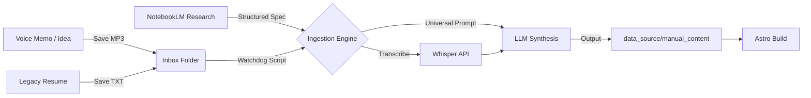

---
title: "Content Strategy & Workflow"
slug: "content_strategy"
sidebar:
  group: "Workflows"
  order: 1
---
# Content Strategy & Workflow

## 1. The Philosophy: Zero-Friction Ingestion
The goal is to convert raw "Brain Dumps" and "Legacy Bullets" into "Datasheet-Grade" portfolio case studies with minimal effort.

### The Architecture ("The Funnel")
The system operates on a "Drop & Forget" principle. You place raw files into an `inbox`, and the system "mineralizes" them into structured Content.

### The Zero-Bloat Principle (R2 Enforcement)
*   **GitHub = Code:** The repository stores source code, markdown, and configuration.
*   **R2 = Assets:** All binary assets (images, videos, GLBs) must be hosted on Cloudflare R2.
*   **Mined Assets:** The `data_source/mined_assets/` directory is for **ephemeral** generation only. It is `.gitignore`'d to prevent repo bloat. Long-term assets must be moved to `R2_STAGING`.



---

## 2. The Hybrid Content System
Quantum uses a **Hybrid Architecture** to manage project data.

### Structured Data (CSV)
*   **Source:** `data_source/Main.csv`, `Expertise.csv`
*   **Purpose:** Metadata, metrics, tags, dates.
*   **Why:** Easy to bulk edit, sort, and analyze.

### Narrative Content (Markdown)
*   **Source:** `data_source/manual_content/{slug}.md`
*   **Purpose:** Detailed case studies, storytelling, code blocks.
*   **Why:** Markdown offers a superior authoring experience for long-form content.

### Content Tiers
To serve different user personas (Recruiters vs. Engineers), we support disparate "resolutions" of the same project:
*   **Full (Hero):** Deep-dive, scrollytelling, "Bubbles", Galleries. (e.g., `c24`)
*   **Lite (Datasheet):** Text-heavy, fast-loading, standard Markdown. (e.g., `c24-lite`)
*   **Redacted (NDA):** Terminal-style, obfuscated details.

---

## 3. Tooling Stack & Extraction Strategy

### Phase 1: Capture (The Universal Inbox)
*   **Location:** `data_source/inbox/`
*   **Philosophy:** "Universal Inbox" Pattern. External scripts or humans dump files here; the engine consumes them.
*   **Research Phase:** Use **NotebookLM** as the pre-ingestion "Chief of Staff" to process large project archives (PDFs, Docs) into structured specifications. See [The NotebookLM Bridge](file:///d:/GitHub/quantum/src/content/docs/NOTEBOOK_LM_BRIDGE.md).
*   **Rule:** Use the **Smart Filename Schema**: `{slug}.{context}.{ext}`
    *   **Simple:** `xbox.mp3` (Implies generic context)
    *   **Contextual:** `xbox.technical.mp3` (Instructs LLM to focus on metrics)
    *   **Social:** `nexus.linkedin.txt` (Instructs LLM to draft a post)
    *   **Data:** `profile.github_stats.json` (Raw data ingestion)

| Tag | Target Persona | Function |
| :--- | :--- | :--- |
| `technical` | **The Engineer** | Hard metrics, specs, tolerances. Strips all fluff. |
| `walkthrough` | **The Architect** | Narrative "STAR" format. Focuses on design decisions and "Why". |
| `rant` | **The Translate Filter** | Extracts valid feedback from frustration. |
| `social` | **The Marketer** | Drafts posts for LinkedIn (Professional) and Twitter (Punchy). |
| `raw` | **The Scribe** | Zero processing. Verbatim transcript/format only. |

*   **Audio:** Record on phone, drop MP3/WAV.
*   **Text:** Dump raw bullets or notes into TXT.

### Phase 2: Synthesis (The Engine)
We use **Gemini 2.5 Pro** via `scripts/ingest_inbox.py`.
*   **Native Audio:** "Hears" tone and nuance directly from audio files.
*   **Extraction:**
    *   **Text Expansion:** Infers standard engineering context from brief resume bullets.
    *   **Audio Structuring:** Filters "ums" and structures rambling into STAR format.
    *   **Proxy Metrics:** Converts qualitative wins ("It didn't crash") into quantitative proxies ("Reliability: 100%").

### Phase 3: Gap Analysis
The system **fails loudly** if data is missing. It injects `> [!WARNING]` alerts into the generated Markdown, prompting you to fill specific gaps.

---

## Workflow: Creating a New Case Study

We have streamlined the process of moving from a "Placeholder" to a "Case Study" using the Scaffolding tool.

### Step 1: Scaffold
Run the ingestion script with the `--scaffold` flag. This checks `Main.csv` for all projects and automatically creates a template markdown file for any project that doesn't have one.

```bash
python ingest_data.py --scaffold
```

### Step 2: Write
Navigate to `data_source/manual_content/` and open the newly created file (e.g., `xbox.md`). You will see a standard template:

*   **The Challenge:** Define the problem.
*   **Engineering Approach:** Explain the solution.
*   **Impact:** Quantify the results.

### Step 3: Ingest
Run the standard ingestion command to build the site with your new content.

```bash
python ingest_data.py
```

### Step 4: Verify
Check the local development server (`npm run dev`) to see your changes live.

---

## Best Practices
*   **Images:** Place images in `R2_STAGING/{slug}/`. They will be auto-detected.
*   **Models:** Place `.glb` files in `R2_STAGING/{slug}/`.
*   **Components:** You can import and use Astro components (like `<YouTube />` or `<ModelViewer />`) directly in the markdown.

### Special Characters
*   **Less-Than Signs:** MDX treats `<` as the start of a component. If you write `<0.5%` or `<3`, it may crash the build. Always escape it as `&lt;` (e.g., `&lt;0.5%`).

# Content Strategy & Workflow

## The Hybrid Content System
Quantum uses a **Hybrid Architecture** to manage project data. This approach combines the structured efficiency of CSVs with the expressive power of Markdown.

### 1. Structured Data (CSV)
*   **Source:** `data_source/Main.csv`, `Expertise.csv`, etc.
*   **Purpose:** Metadata, metrics, tags, dates, and relationships.
*   **Why:** Easy to bulk edit, sort, and analyze. Perfect for the "Datasheet" aspect of the site.

### 2. Narrative Content (Markdown)
*   **Source:** `data_source/manual_content/{slug}.md`
*   **Purpose:** Detailed case studies, storytelling, code blocks, and rich media.
*   **Why:** Writing long-form content in CSV cells is painful and error-prone. Markdown offers a superior authoring experience.

---

## Workflow: Creating a New Case Study

We have streamlined the process of moving from a "Placeholder" to a "Case Study" using the Scaffolding tool.

### Step 1: Scaffold
Run the ingestion script with the `--scaffold` flag. This checks `Main.csv` for all projects and automatically creates a template markdown file for any project that doesn't have one.

```bash
python ingest_data.py --scaffold
```

### Step 2: Write
Navigate to `data_source/manual_content/` and open the newly created file (e.g., `xbox.md`). You will see a standard template:

*   **The Challenge:** Define the problem.
*   **Engineering Approach:** Explain the solution.
*   **Impact:** Quantify the results.

### Step 3: Ingest
Run the standard ingestion command to build the site with your new content.

```bash
python ingest_data.py
```

### Step 4: Verify
Check the local development server (`npm run dev`) to see your changes live.

---

## Best Practices
*   **Images:** Place images in `R2_STAGING/{slug}/`. They will be auto-detected.
*   **Models:** Place `.glb` files in `R2_STAGING/{slug}/`.
*   **Components:** You can import and use Astro components (like `<YouTube />` or `<ModelViewer />`) directly in the markdown.

### Special Characters
*   **Less-Than Signs:** MDX treats `<` as the start of a component. If you write `<0.5%` or `<3`, it may crash the build. Always escape it as `&lt;` (e.g., `&lt;0.5%`).

## Manual Content Overrides

### 3. Special Components
*   **3D Models:**
    *   **Standard:** Use `{{MODEL_URL}}` placeholder.
    *   **Custom Layout:** You **MUST** wrap the placeholder in the component: `<ModelViewer src="{{MODEL_URL}}" alt="Project Asset" />`.
    *   **Fallback:** Omit the `src` attribute to display the "Neil Armstrong" placeholder: `<ModelViewer alt="Placeholder" />`.

### 5. The Kitchen Sink (Dreamjob)
*   **Concept:** Use `dreamjob` as the master reference for all available components.
*   **Usage:** If you create a new DLS component (e.g., a new chart type), add an example to `data_source/manual_content/dreamjob.md` to verify it renders correctly in the "Visual Taxonomy".
